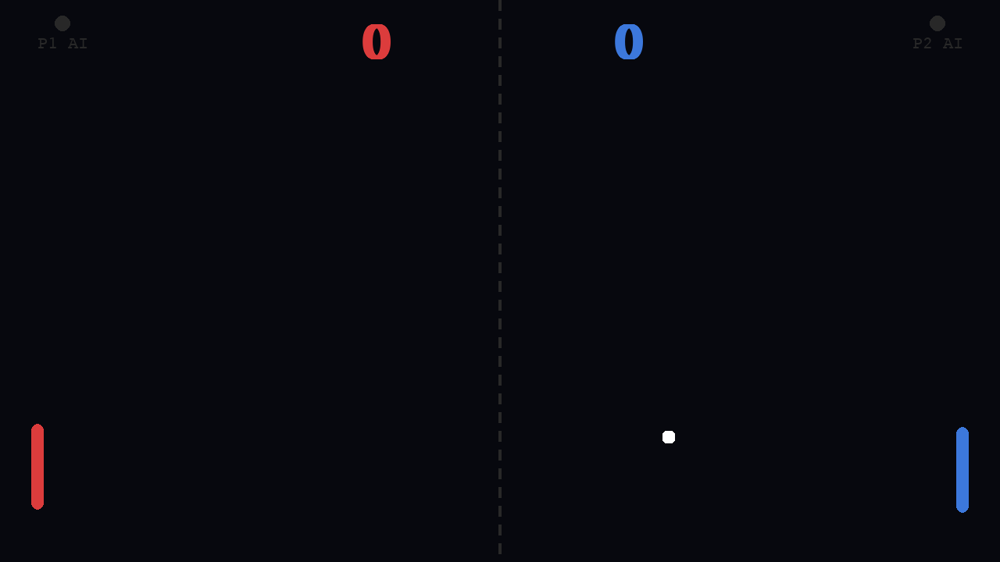

# Python Games — Hand-Controlled Pong & Word Guess


👤 **Portfolio:** [s-harshni.github.io/S-Harshni](https://s-harshni.github.io/S-Harshni/)

Two small Python games: a **two-player Pong controlled by your index fingers** through the webcam (computer vision with MediaPipe), and a **Tkinter word-guessing game**.



## 🏓 Hand-Controlled Pong (`pong_cv.py`)

- **Computer-vision controls:** MediaPipe tracks up to two hands in the webcam feed. The hand on the left half of the frame drives the red paddle and the right hand drives the blue one, following the **index fingertip** (landmark 8).
- **Smooth motion:** paddles ease toward the target with linear interpolation instead of jumping.
- **Physics:** the bounce angle depends on where the ball hits the paddle (up to ±55°), and speed increases on every hit up to a cap.
- **Game flow:** first to 4 wins; `R` restarts, `Q` / `Esc` quits. On-screen indicators show whether each player is tracked.
- **Keyboard fallback:** with no webcam or no visible hand, use **W/S** (left) and **↑/↓** (right).
- **Demo mode:** `--demo` runs AI vs AI without a camera.

```bash
pip install -r requirements.txt
python pong_cv.py            # webcam + hand tracking (keyboard fallback)
python pong_cv.py --demo     # no webcam: AI vs AI
python pong_cv.py --demo --screenshot pong.png --frames 90   # save a frame and exit
```

## 🔤 Word Guess (`pythongame.py`)

A Tkinter game: guess a hidden programming-themed word one letter at a time with 5 lives. It validates input, ignores repeated letters, and shows win/lose dialogs.

```bash
python pythongame.py
```

## How the hand tracking works

```
webcam frame ─► flip (mirror) ─► MediaPipe Hands (21 landmarks per hand)
            ─► split hands by wrist x (left half = P1, right half = P2)
            ─► index fingertip y ─► paddle target ─► lerp ─► draw over the camera feed
```

## Changes in this version

- **No more freeze without a webcam.** The loop used to `continue` forever on failed camera reads without handling window events, so the window couldn't even be closed. Keyboard control now takes over.
- **Works on current MediaPipe.** MediaPipe 1.x removed the `mp.solutions` API the game used, so it crashed on import. It now falls back to the keyboard, and `requirements.txt` pins 0.10.21 for hand tracking.
- Added `--demo` / `--screenshot` modes, frame resizing to the window, and `requirements.txt`.

## Author

**S Harshni** · [Portfolio](https://s-harshni.github.io/S-Harshni/) · [LinkedIn](https://www.linkedin.com/in/ks-harshni/) · [GitHub](https://github.com/S-Harshni)
